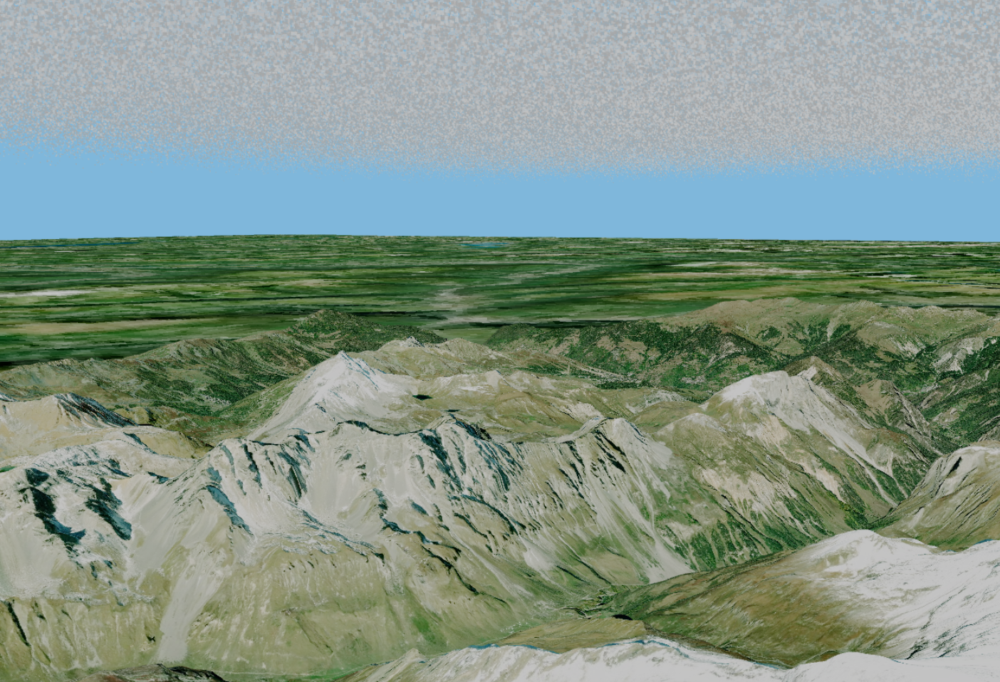
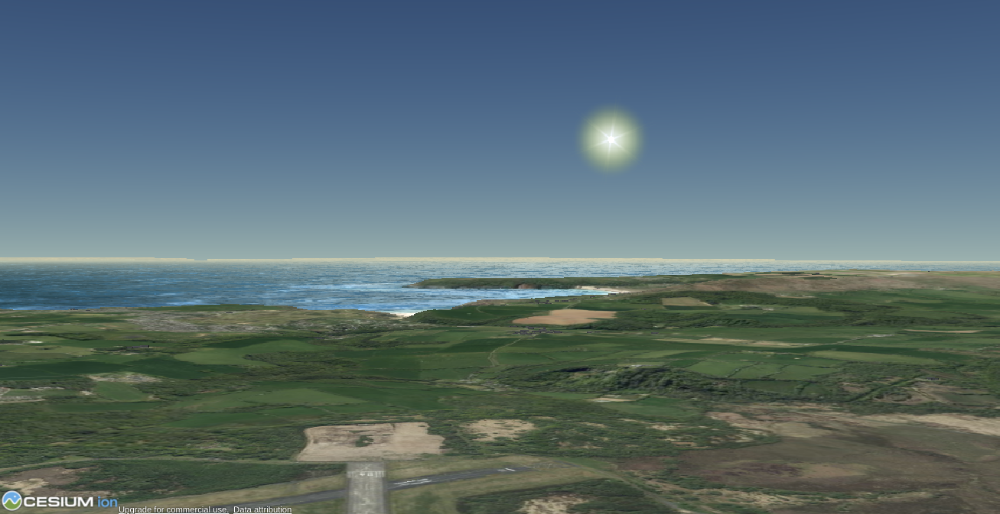

# open-flight-sim
A project to create a fully functioning, open source flight simulator with good performance.

# TODO:
- [x] Create a page for the user to create and input a mapbox API key. This will be used for the terrain data.
- [x] Allow the page to validate the user's API access token.
- [x] Store the access token somehow
- [x] Create a page to allow the user to choose an airport and runway to begin at.
- [x] Create the main page where the user can fly the airplane. 
- [x] Allow the main page to download the terrain.
- [x] Allow each tile of the terrain to have elevation data.
- [x] Allow the user to choose the radius of the tile.
- [x] Add an option for the user to add & customise fog.
- [x] Give the program an active tile - and a secondry tile to be in the background.
- [x] Add 3d particle clouds.
- [x] Rename "findLocation" to setupPage.
- [x] Allow the clouds to be adjusted in the setup page.
- [ ] Allow the user to adjust the height of the secondary tile.
- [ ] Give the tiles building & tree data.
- [ ] Add a plane 3d model.
- [ ] Add physics.
- [ ] Allow the user to refresh the tile from a minimap - which automatically updates.
- [ ] Add more settings to the clouds in the setup page.
- [ ] Allow the plane to collide with the terrain.
- [ ] Add UI features - a throttle, a speed guage, an artificial horizon, etc.
- [ ] Add weather & realistic lighting.
- [ ] Add emergency capabilities to aircraft.
- [ ] Add a settings panel to edit everything.
- [ ] Add realistic volumetric lighting.

# How to use
* `pip3 install flask`
* `git clone https://github.com/nathan-a-macleod/open-flight-sim.git`
* `cd open-flight-sim/src`
* `python3 app.py`

# Contributing
If you would like to contribute, please go ahead! The more people who can contribute to this project, the quicker it will improve and the more polished it will be. Helping with the project will also help it to gain popularity, so that more people will discover it - meaning it will improve faster and faster.
