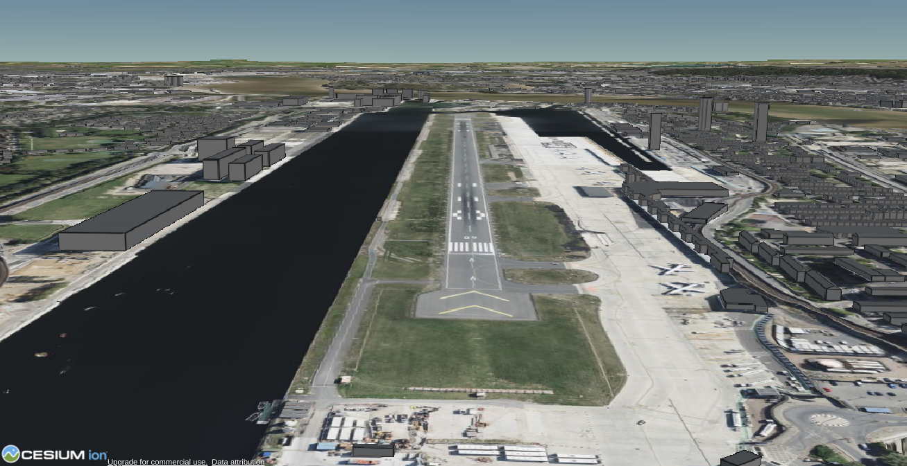
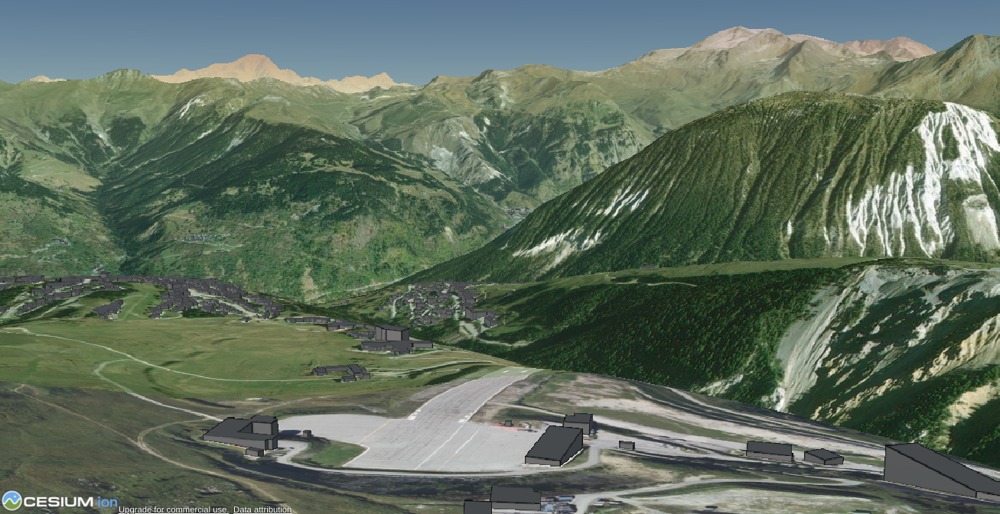

# open-flight-sim
A project to create a fully functioning, open source flight simulator with good performance.

# TODO:
- [x] Create a page for the user to create and input an API access token.
- [x] Store the access token somehow.
- [x] Create a page to allow the user to choose an airport and runway to begin at.
- [x] Create the main page where the user can fly the airplane. 
- [x] Allow the main page to download the terrain.
- [x] Allow each tile of the terrain to have elevation data.
- [x] Allow the user to choose the radius of the tile.
- [x] Add an option for the user to add & customise fog.
- [x] Give the program an active tile - and a secondry tile to be in the background.
- [ ] Add 3d particle clouds.
- [x] Rename "findLocation" to setupPage.
- [x] Allow the clouds to be adjusted in the setup page.
- [x] Add movement to the clouds.
- [x] Migrate to Cesium.js.
- [x] Add a reset button.
- [x] Remove uneeded Cesium.js objects in the canvas.
- [x] Allow the game to switch between flying, and choose a location. Ensure it starts of by allowing the user to switch between these, instead of using the setupSection.
- [x] Add a pause button where the user can change the position of the plane.
- [x] Change the pause button to a keyboard shortcut.
- [x] Change the settings page to an overlay.
- [x] Add a plane 3d model.
- [x] Change the pause hotkey to "p".
- [x] Add a throttle.
- [x] Add a speed indicator.
- [ ] Integrate the plane 3d model in a separate canvas.
- [ ] Add a shadow under the plane.
- [ ] Add more CSS variables.
- [ ] Add 3d particle based clouds.
- [ ] Add more settings to the clouds in the setup page - a proper weather engine.
- [ ] Add better physics.
- [ ] Prevent the camera from going underground.
- [ ] Allow the plane to collide with the terrain.
- [ ] Add UI features - a throttle, a speed guage, an artificial horizon, etc.
- [ ] Add weather & realistic lighting.
- [ ] Add emergency capabilities to aircraft.
- [ ] Add a settings panel to edit everything.
- [ ] Add realistic volumetric lighting.

# How to use
* `pip3 install flask`
* `git clone https://github.com/nathan-a-macleod/open-flight-sim.git`
* `cd open-flight-sim/src`
* `python3 app.py`

# Contributing
If you would like to contribute, please go ahead! The more people who can contribute to this project, the quicker it will improve and the more polished it will be. Helping with the project will also help it to gain popularity, so that more people will discover it - meaning it will improve faster and faster.
